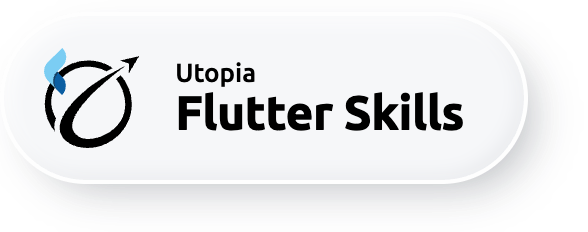
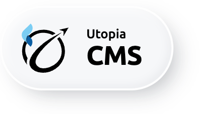

# 👾 utopia-flutter-skills

**Codex and Claude Code plugins for building Flutter apps with React-like hooks, Screen/State/View structure, and generated CMS/admin panels** - by [UtopiaSoftware](https://utopiasoft.io).

`utopia-flutter-skills` helps AI coding agents write Flutter in a predictable,
product-team-friendly style: hooks instead of widget ceremony, clean screen
boundaries, reusable app architecture, and admin-panel patterns powered by
`utopia_cms`.

```bash
# Claude Code
/plugin marketplace add Utopia-USS/utopia-flutter-skills
/plugin install utopia-hooks@utopia-flutter-skills
/plugin install utopia-cms@utopia-flutter-skills
# ...and more - see Installation below

# Codex
codex plugin marketplace add Utopia-USS/utopia-flutter-skills --ref main
codex plugin install utopia-hooks@utopia-flutter-skills
codex plugin install utopia-cms@utopia-flutter-skills
# ...and more - see Installation below
```

> Drop-in for Claude Code and Codex. Works alongside existing Flutter state-management patterns.

---

## Why

Most Flutter AI tooling is either framework-specific or unopinionated boilerplate.
`utopia-flutter-skills` is:

- **React-friendly** - hooks-first Flutter patterns for people who like composable state and small view functions.
- **Screen/State/View-first** - predictable file boundaries, no `StatefulWidget` ceremony.
- **Admin-ready** - `utopia_cms` patterns for CMS, back-office, and internal-tool screens.
- **BSD-2-Clause, hackable** - fork it, edit a skill, push back. No license lock-in.
- **Battle-tested** - distilled from production Flutter apps shipped by UtopiaSoftware.
- **Convention-enforcing** - `utopia_cli` analysis catches drift through Claude hooks, Codex/MCP tools, or manual CLI checks.

This is the AI tooling we use ourselves. We open-sourced it so the rest of the Flutter community can use it too.

## What's inside

| Plugin | What it does |
|---|---|
| <a href="plugins/utopia-hooks/"></a> | Holistic Flutter-with-hooks guide. Screen/State/View, hook catalog, global state, async patterns, paginated lists, DI, testing. |
| <a href="plugins/utopia-cms/"></a> | Flutter CMS / admin panels with `utopia_cms`. `CmsWidget` shell, `CmsTablePage`, delegates for Firebase/Supabase/Hasura/GraphQL, entry catalog, filters, custom actions, management sections, and review guidance for avoiding hand-rolled DataTable + service anti-patterns. |
| <a href="plugins/utopia-ai-arch/"></a> | Scaffold and maintain an agent-aware project layer (skills, commands, hooks, refs, architecture log) for Flutter projects. |
| <a href="plugins/utopia-hooks-migrate-bloc/"></a> | Migrate BLoC/Cubit codebases to `utopia_hooks` - two-phase (global states first, then screens), per-commit granularity, and orchestrated inventory / foundation / global-state / screen / review sub-agents. |
| <a href="plugins/utopia-reviews/"></a> | Code reviews as a two-way agent conversation on GitHub / GitLab / Bitbucket. `utopia-code-review` gives a severity-ranked, Utopia-aware review of a PR/MR or a local branch pair; `utopia-resolve-code-review` triages the comments on your own PR and - after one approval gate - fixes, pushes, replies, and resolves. |
| <a href="plugins/utopia-pubdev/"></a> | Standardize pub.dev package READMEs - brand-chip header, house voice, section structure, restrained four-colour badge row, sibling footer, and a tool-agnostic AI-assistants section. Bundles the brand-chip header generator. |

Canonical hook reference list lives in [`plugins/utopia-hooks/skills/utopia-hooks/SKILL.md`](plugins/utopia-hooks/skills/utopia-hooks/SKILL.md).

## How it compares

| | utopia-flutter-skills | Typical state-management packages | Generic AI coding setup |
|---|---|---|---|
| State pattern | Hooks (Screen/State/View) | Library-specific patterns | Unspecified |
| Agent skills | Core plugins for Claude Code and Codex | - | Manual prompts |
| CLI scaffolder | [`utopia_cli`](https://github.com/Utopia-USS/utopia_cli) | - | Usually separate |
| License | BSD-2-Clause | Varies | Varies |
| Lock-in | None | Package-specific | Tooling-specific |

## Installation

### Claude Code

The `utopia-hooks` quality analysis is powered by `utopia_cli`, so make sure
`utopia` is available on `PATH`:

```bash
dart pub global activate utopia_cli
```

```bash
# Register the marketplace
/plugin marketplace add Utopia-USS/utopia-flutter-skills

# Install any of the plugins
/plugin install utopia-hooks@utopia-flutter-skills
/plugin install utopia-cms@utopia-flutter-skills
/plugin install utopia-ai-arch@utopia-flutter-skills
/plugin install utopia-hooks-migrate-bloc@utopia-flutter-skills
/plugin install utopia-reviews@utopia-flutter-skills
/plugin install utopia-pubdev@utopia-flutter-skills
```

### Codex

These plugins ship through this repo's Codex marketplace. Keep `utopia` on `PATH`
for quality analysis:

```bash
dart pub global activate utopia_cli
```

```bash
# Register the marketplace from GitHub
codex plugin marketplace add Utopia-USS/utopia-flutter-skills --ref main

# Install the Codex plugins
codex plugin install utopia-hooks@utopia-flutter-skills
codex plugin install utopia-cms@utopia-flutter-skills
codex plugin install utopia-pubdev@utopia-flutter-skills
```

### One-command project setup with `utopia-cli`

```bash
dart pub global activate utopia_cli
utopia create flutter_app my_app --org io.example
cd my_app
# Open the project in Claude Code or register this repo marketplace in Codex.
claude
# or:
codex plugin marketplace add Utopia-USS/utopia-flutter-skills --ref main
```

You get a Flutter app with `utopia_hooks` + `utopia_arch` scaffolding **and** an AI-agent layer that already knows your project's conventions.

## Documentation

- [Screen/State/View pattern](plugins/utopia-hooks/skills/utopia-hooks/SKILL.md)
- [Hook catalog](plugins/utopia-hooks/skills/utopia-hooks/references/)
- [CMS / admin-panel guide](plugins/utopia-cms/skills/utopia-cms/SKILL.md)

## Companion packages

Published on [pub.dev](https://pub.dev/publishers/utopiasoft.io):

| Package | What it is |
|---|---|
| [`utopia_hooks`](https://pub.dev/packages/utopia_hooks) | Hooks framework |
| [`utopia_arch`](https://pub.dev/packages/utopia_arch) | Architecture layer (DI, preferences, error handling) |
| [`utopia_cms`](https://pub.dev/packages/utopia_cms) | Flutter CMS / admin-panel framework |
| [`utopia_hooks_riverpod`](https://pub.dev/packages/utopia_hooks_riverpod) | Riverpod bridge |
| [`utopia_lints`](https://pub.dev/packages/utopia_lints) | Shared lint pack |

Compatible with [`fast_immutable_collections`](https://pub.dev/packages/fast_immutable_collections) (`IList`, `IMap`, `ISet`).

Built by [UtopiaSoftware](https://utopiasoft.io).

## Contributing

Issues and PRs welcome. Skills are designed to be forked - copy a skill into your own Claude Code or Codex setup, tweak the rules, and ship it.

## License

BSD 2-Clause - see [LICENSE](LICENSE).
